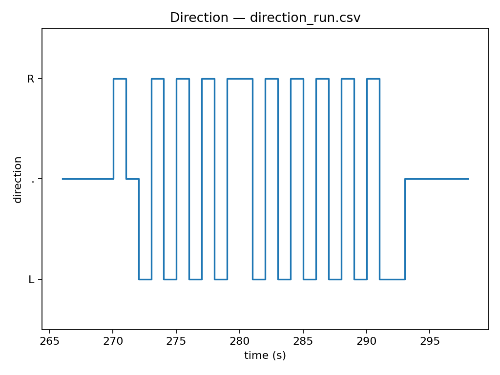

# Neuromorphic Event-Based Vision Sensor

A two-pixel event-based vision system that detects changes in illumination and estimates the direction of motion using asynchronous events.

The system combines analog photodiode circuitry, an ESP32 for interrupt-driven event processing, and a Python analysis pipeline for visualization and experimental validation.

---

## Overview

Conventional cameras continuously capture complete image frames, even when most of the scene remains unchanged.

Event-based vision takes a different approach: individual pixels generate events when they detect a significant change in illumination.

This project explores that concept using a custom two-pixel sensor. Each sensing channel converts changes in incident light into an electrical signal, which is conditioned by the analog circuitry and used to generate events.

By comparing the timing of events generated by the two channels, the system estimates whether an object moved from left to right or from right to left.

---

## System Architecture

```text
             Light / Moving Object
                     │
          ┌──────────┴──────────┐
          ▼                     ▼
     Photodiode A          Photodiode B
          │                     │
          ▼                     ▼
     Analog Front End      Analog Front End
          │                     │
          ▼                     ▼
      Event A                 Event B
          │                     │
          └──────────┬──────────┘
                     ▼
                   ESP32
                     │
            Interrupt Processing
                     │
             Event Timing Logic
                     │
                     ▼
          Motion Direction Estimate
                     │
                     ▼
                 CSV Output
                     │
                     ▼
             Python Analysis
```

---

## Hardware

The prototype consists of two independent light-sensing channels built around photodiodes and LM324-based analog circuitry.

Each photodiode responds to changes in incident light. The analog front end conditions this signal, and a comparator stage generates an event when the signal crosses the selected threshold. These events are then sent to interrupt-capable GPIO pins on the ESP32.

### Main Components

- ESP32 microcontroller
- Two photodiodes
- LM324N quad operational amplifier
- Analog signal-conditioning circuitry
- Comparator-based event generation
- Breadboard prototype

### Prototype


---

## Event-Based Processing

Instead of continuously processing complete images, the system responds only when an illumination change generates an event.

The comparator outputs are connected to ESP32 interrupt-capable GPIO pins.

When an event occurs, an interrupt service routine:

1. records the event,
2. timestamps its occurrence,
3. updates the event counter,
4. applies a refractory period to suppress repeated triggering.

A refractory interval of approximately **80 ms** is used to reduce duplicate events caused by a single illumination transition.

---

## Motion Direction Detection

Direction is estimated from the temporal ordering of events generated by the two pixels.

Conceptually:

```text
Pixel A triggers → Pixel B triggers  =  A → B motion

Pixel B triggers → Pixel A triggers  =  B → A motion
```

Events are associated within a defined temporal window. If both channels generate events sufficiently close together, their timestamps are compared to determine the direction of motion.

This allows the system to extract basic spatial information from asynchronous events without capturing conventional image frames.

---

## Firmware

The ESP32 firmware is written in C++ using the Arduino framework.

It handles:

- ADC acquisition
- interrupt-driven event detection
- event counting
- refractory timing
- timestamp generation
- motion direction estimation
- serial CSV output

Firmware source:

```text
firmware/vision_sensor.ino
```

---

## Python Visualization

A Python analysis tool processes the CSV data generated by the ESP32.

The visualization pipeline uses:

- Python
- pandas
- matplotlib

It processes the recorded sensor data and generates plots for:

- analog channel voltages
- detected events / spikes
- estimated motion direction

Source:

```text
python/visualizer.py
```

---

## Experimental Results

The system was tested under different illumination and motion conditions.

### No-Light Test

This test evaluates the sensor response under low-illumination conditions and provides a baseline for the two sensing channels.

Experimental data and plots are available in:

```text
results/no-light/
```

### Full-Light Test

This test evaluates the response of both channels under strong illumination.

Experimental data and plots are available in:

```text
results/full-light/
```

### Changing-Direction Test

To test the direction-detection logic, I moved an object back and forth across the two sensing channels, alternating between left-to-right and right-to-left motion for **20 consecutive direction changes**.

The system correctly detected **18 of 20 direction changes (90%)**.

The plot below shows the estimated direction over time, where `R` represents rightward motion and `L` represents leftward motion.



The raw CSV measurements and additional voltage and event plots are available in:

```text
results/changing-directions/
```


---

## Key Results

- Built and tested a two-pixel event-based vision sensor using photodiodes and LM324-based analog circuitry
- Implemented interrupt-driven event processing and temporal correlation on an ESP32
- Correctly detected 18 of 20 alternating direction changes (90%) in experimental testing
- Logged sensor and event data to CSV for offline analysis
- Built a Python pipeline for voltage, event, and direction visualization
